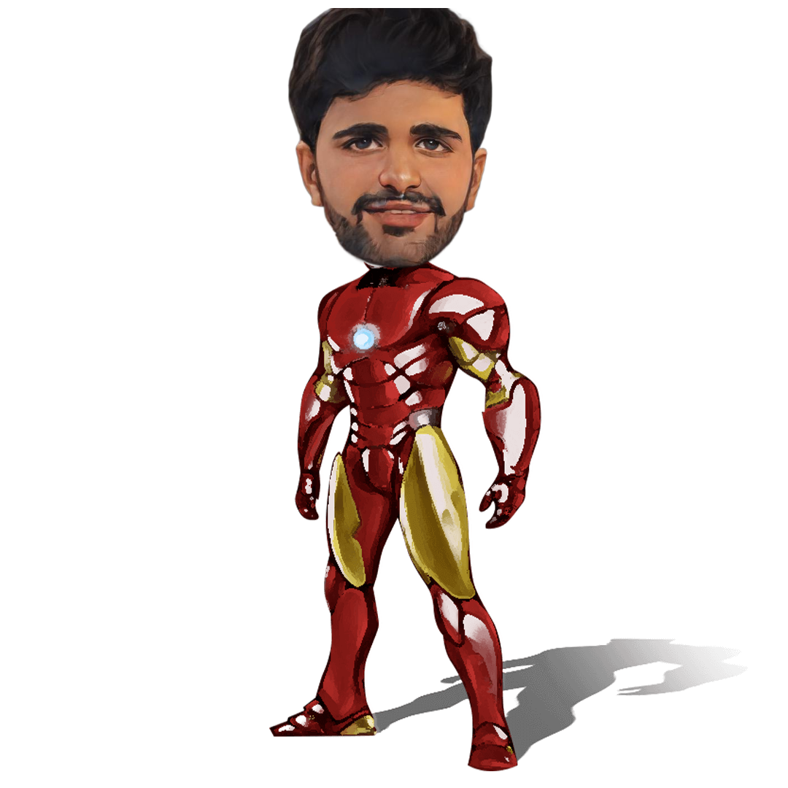

  
  

  

# :wave: Hi Dear!

## 👨‍💻: About Me :
###  Techy nerd who loves playing around with new neat stuff
A motivated individual with in-depth knowledge of full stack web
development with 3+ years of experience, seeking a position in a
growth-oriented company where I can use my skills to the
advantage of the company while having the scope to develop my
own skills. Passionate about WEB 3.O  and cloud computing, always love to learn new technologies
 
### 🔨🔍: Languages and Tools :

  &nbsp;
  &nbsp;
  &nbsp;
  &nbsp;
  &nbsp;
  &nbsp;
  &nbsp;
  &nbsp;
  &nbsp;
   &nbsp;
   &nbsp;
  &nbsp;
  &nbsp;
   &nbsp;
   &nbsp;
   &nbsp;
   &nbsp;
  &nbsp;
  &nbsp;
  &nbsp;
  &nbsp;
   &nbsp;
  &nbsp;
  &nbsp;
   &nbsp;
  &nbsp;
  &nbsp;
  &nbsp;
  &nbsp;
 

### 🔥: My Stats :

